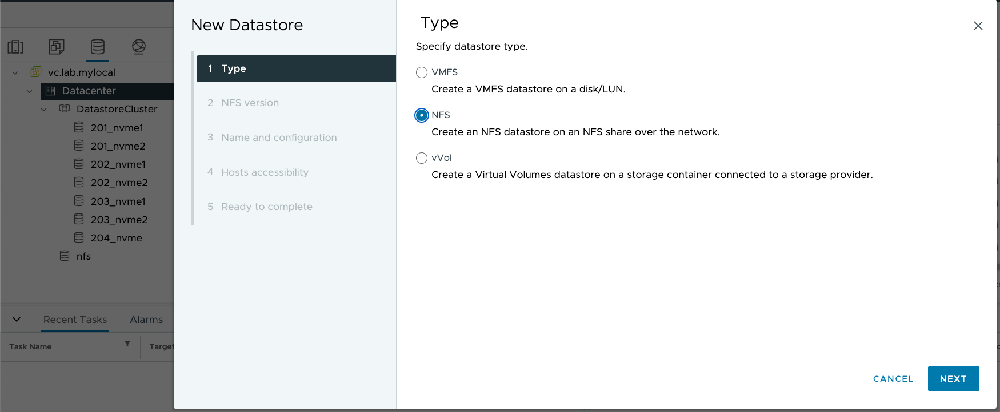
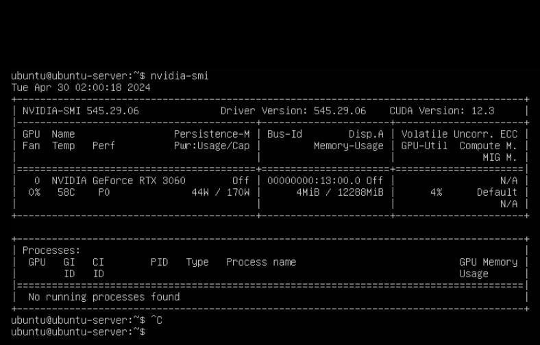

## Packer build for Ubuntu 22.04 with NVIDIA drivers
Summary: Tired of manually configuring Ubuntu 22.04 with NVIDIA dependencies and drivers? This packer build and gitlab CI template will create a Ubuntu 22.04 vSphere template with NVIDIA drivers installed and upload it to a vSphere content library.

## Acknowledgements
Used code from the following github repos to create this packer build:
- https://github.com/vmware-samples/packer-examples-for-vsphere/blob/develop/builds/linux/ubuntu/24-04-lts/linux-ubuntu.pkr.hcl


## Prerequisites
1. packer must be installed on system running packer build
1. download ubuntu version 22.04 iso (e.g. distrowatch.com)
1. nfs datastore mounted in vsphere to store photon iso used during packer build

1. install make ```sudo apt install make```
1. if using gitlab to run packer build, you'll need the following:
    - gitlab project with personal access token
    - gitlab runner with packer installed or docker executor that can pull packer image

## Getting Started (local packer build)
1. update variables in .env_template and rename to .env
2. run ```make main``` to:
    - run ```packer validate``` -> validates packer template
    - run ```packer build``` -> creates ubuntu 22.04 template with nvidia drivers

## Getting Started (gitlab build)
1. create project and access token
1. update variables in .env_template and rename to .env
1. run ```add_project_variables.py``` script to add variables to project
1. push code to gitlab repository -> .gitlab-ci.yml will run packer build
1. after successful build, create VM from template in vSphere, add PCI GPU device, and run ```nvidia-smi``` to verify VM can see GPU


## GOTCHAS
1. autoinstall sha-512 hashed password must be configured as raw string in gitlab ci variables; otherwise `$` characters will attempt to reference variables
1. ```build_password``` and ```build_password_encrypted``` must be the same for autoinstall to work

## TODO
- [ ] Refactor ```scripts/3-install_cuda.sh``` script to use distribution specific package manager for CUDA installation
- [ ] Create terraform template to deploy VM from template (using vsphere provider), add PCI GPU device

